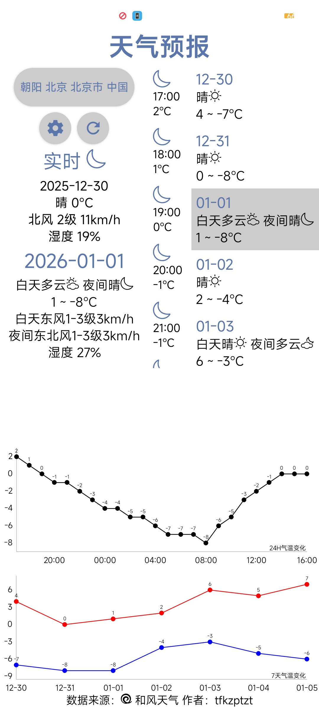
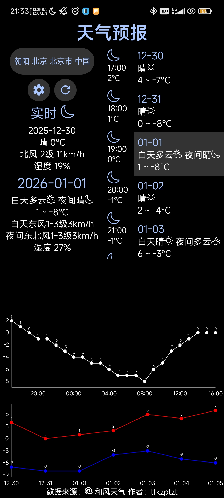

# Weather Report 天气预报

使用App Inventor编写
 Coding by App Inventor

这个软件最早是我高一参加比赛写的，最近翻出来再改改。

  特别感谢 
  《App Inventor开发实战》的作者金从军 
  Pura Vida Apps: https://puravidaapps.com 
  M³Colors: https://kaffeine.tech/m3colors 
  ASCII conversion extension: https://community.appinventor.mit.edu/t/ascii-conversion-extension/80973 
  Enhance界面增强扩展: https://wangsk789.github.io/enhance 
  App Inventor: https://code.appinventor.mit.edu 
  https://login.appinventor.mit.edu/login 
  API: https://dev.qweather.com 
  Weather Icons: https://github.com/qwd/Icons

